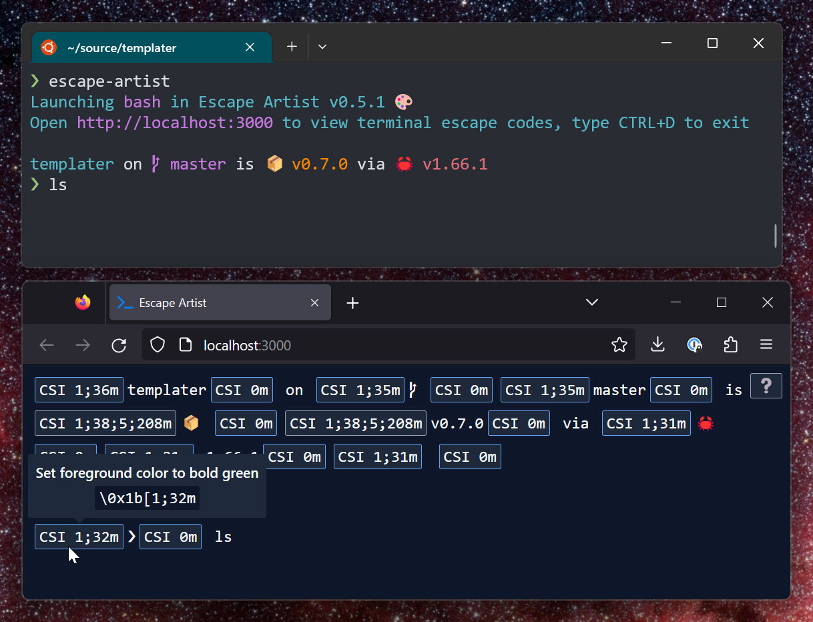

# Escape Artist

Escape Artist is a tool for seeing ANSI escape codes in terminal applications. You interact with your shell just like you normally would, and it shows the normally-invisible escape codes in a web UI:

## Installation

Binaries for major OSs+architectures are attached to the GitHub releases, download+expand one and put it in your PATH. Alternately, you can build+install with Rust's Cargo package manager. [Install Rust](https://rustup.rs/), then run `cargo install escape-artist`

After that, you can launch Escape Artist by running `escape-artist` in your terminal.

## Project Status

This was hacked together for the [Handmade Network Visibility Jam](https://handmade.network/jam/visibility-2023), so it might be a little rough around the edges. It's primarily been developed on Linux, but I used cross-platform libraries and my limited testing on Windows+macOS has gone well.

## FAQ

**Q:** What are ANSI escape codes?

**A:** "Invisible" byte sequences that are printed by console applications to stdout and stderr, then interpreted by your terminal emulator. For example, an escape code might tell the terminal to paint all text green until further notice. There are several kinds of escape sequences, [this page](https://gist.github.com/fnky/458719343aabd01cfb17a3a4f7296797) is a great reference.

**Q:** What does Escape Artist do?

**A:** It launches your shell in a [pseudoterminal](https://devblogs.microsoft.com/commandline/windows-command-line-introducing-the-windows-pseudo-console-conpty/#enter-the-pseudo-terminal-pty) (AKA a pty) and starts a web interface where you can view the output of the shell with escape sequences made visible. You can mouse over individual escape codes to see their raw bytes and (sometimes) a description of what the escape code does.

**Q:** Why is this useful?

**A:** It's kinda like View Source for the terminal. Maybe you're curious about what your shell is doing to render your cool new prompt. Maybe you work on a shell or a TUI application and you need to debug it.

**Q:** How can I configure Escape Artist?

**A:** Run Escape Artist with the `-h` or `--help` flag to see all possible options.

## Contributions

Contributions are welcome! This project could certainly use some polish.

Note that I am trying to keep the web front-end of this project as simple as possible. The project currently has no front-end build step, and I would like to keep it that way unless a *very* compelling reason comes along.